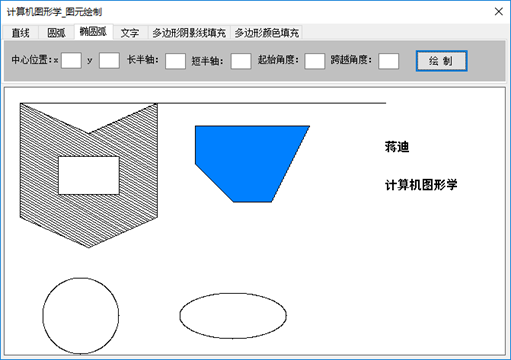
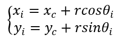
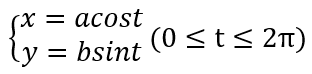

## 一、功能要求
实现一个图形函数库，具有绘制直线段、任意圆弧、椭圆弧、多边形区域的阴影填充和颜色填充等功能，仅调用画点函数 Windows API: setpixel(hdc,x,y,color)


[源码地址](https://github.com/str818/DarwGraphElementThroughPixel)
## 二、实现效果

<div align="center">   </div><br>

## 三、算法实现

### 1. 绘制直线
绘制直线使用的是 DDA 算法（数字微分分析法），该算法的核心思想是依据直线的微分方程依次确定描述直线的各个像素点。
例如，已知直线的两个端点为 (x1,y1) 与 (x2,y2) ，则两个方向的变化量为 dx=x2-x1，dy=y2-y1 ，两个方向最大变化量的绝对值为 step=max(|dx|,|dy|)，这时就可以计算两个方向的增量 xin=dx/steps，yin=dy/steps。得出增量后利用循环的方式依次绘制 x=x+xin 与 y=y+yin。
具体实现代码如下：
```csharp
//绘制线段_DDA算法
public void DrawLineDDA(int xStart, int yStart, int xEnd, int yEnd, int lineWidth,int color)
{
    int dx = xEnd - xStart, dy = yEnd - yStart;

    int steps = Math.Abs(dx) > Math.Abs(dy) ? Math.Abs(dx) : Math.Abs(dy);

    float xIncrement = dx / (float)steps;
    float yIncrement = dy / (float)steps;

    float x = xStart, y = yStart;

    DrawLinePixel((int)Math.Round(x), (int)Math.Round(y), lineWidth,color);
    for (int i = 0; i < steps; i++)
    {
        x += xIncrement;
        y += yIncrement;

        DrawLinePixel((int)Math.Round(x), (int)Math.Round(y), lineWidth,color);
    }
}
```

### 2. 绘制圆弧
根据圆心和半径可直接计算每个顶点的坐标，设内接正多边形的一个顶点为 Pi(xi,yi)，角度为 θi，则可得出：
<div align="center">   </div><br>
具体实现代码如下：

```csharp
//绘制圆弧
public void DrawArc(int centerX, int centerY, int startAngle, int sweepAngle, int r)
{
    double startA = startAngle * Math.PI / 180;
    double sweepA = sweepAngle * Math.PI / 180;

    double span = 0.3 * Math.PI / 180;
    for(double i = startA; i <= startA + sweepA; i += span)
    {
        int x = (int)(centerX + r * Math.Cos(i - Math.PI / 2));
        int y = (int)(centerY + r * Math.Sin(i - Math.PI / 2));
        setPixel(x, y,0);
    }
}
```
### 3. 绘制椭圆弧
绘制椭圆弧的思想与圆弧类似，利用了椭圆的参数方程：
<div align="center">   </div><br>
具体实现代码如下：

```csharp
//绘制椭圆弧
public void DrawEllipseArc(int centerX, int centerY, int a, int b, int startAngle, int sweepAngle)
{
    double startA = startAngle * Math.PI / 180;
    double sweepA = sweepAngle * Math.PI / 180;

    double span = 0.3 * Math.PI / 180;
    for (double i = startA; i <= startA + sweepA; i += span)
    {
        int x = (int)(centerX + a * Math.Cos(i - Math.PI / 2));
        int y = (int)(centerY + b * Math.Sin(i - Math.PI / 2));
        setPixel(x, y,0);
    }
}
```

### 4. 绘制文字
文字的绘制是通过扫描矢量字符实现的，加载任一字库（这里加载了 hzk16h 字库），根据文字计算出对应字模在字库中的位置，之后就可以将此字符掩膜中每个像素对应位置平移后的值写入显示缓存，从而在屏幕上显示此字符。
具体实现代码如下：

```csharp
//绘制文字  
public void DrawString(String massage,int x, int y){  
    FileStream fsHzk16 = new FileStream("hzk16h", FileMode.Open);  
    for(int i = 0; i < massage.Length; i++){  
        string s = massage.Substring(i, 1);  
        int[] key = { 0x80, 0x40, 0x20, 0x10, 0x08, 0x04, 0x02, 0x01 };  
        byte[] bMsg = new byte[32];  
        byte[] bytes = Encoding.GetEncoding("GB2312").GetBytes(s.ToCharArray());
        int offset = 32 * (94 * (bytes[0] - 0xA1) + bytes[1] - 0xA1);  
        fsHzk16.Seek(offset, SeekOrigin.Begin);  
        fsHzk16.Read(bMsg, 0, 32);  
        for(int k = 0; k < 16; k++){  
            for(int j = 0; j < 2; j++){  
                for(int d = 0; d < 8; d++){  
                    int flag = bMsg[k * 2 + j] & key[d%8];  
                    if (flag != 0){  
                        setPixel((j * 8) + d + i * 16 + x, k + y,0);  
    }}}}}  
    fsHzk16.Close();  
}  
```

### 5. 绘制多边形阴影线
基本思想是用扫描线按照给定的角度扫描整个多边形，每跟扫描线都会与多边形的某些边产生一系列的交点，将这些交点按照 x 坐标排序，将排序后的点两两组对，作为线段的两个端点，将两个端点相连即可。
具体实现代码如下：

```csharp
// 绘制多边形阴影线  
public void DrawShadowLine(Point[] OuterPoint, Point[] InnerPoint, int angle, int h){  
    // 绘制多边形外环与内环轮廓  
    DrawPolygon(OuterPoint);  
    DrawPolygon(InnerPoint);  
    // 各棱两边端点按阴影线斜率引线产生的截距数组  
    Point[] outerIntercept = new Point[OuterPoint.Length];  
    Point[] innerIntercept = new Point[InnerPoint.Length];  
    // 初始化外环每条棱边的截距  
    double k = Math.Tan(angle * Math.PI / 180);// 阴影线斜率  
    initIntercept(OuterPoint, outerIntercept, k);  
    initIntercept(InnerPoint, innerIntercept, k);  
    // 计算出最大截距与最小截距  
    double minIntercept = double.MaxValue;  
    double maxIntercept = double.MinValue;  
    for(int i = 0; i< outerIntercept.Length; i++){  
        if (outerIntercept[i].x < minIntercept) minIntercept = outerIntercept[i].x;  
        if (outerIntercept[i].y > maxIntercept) maxIntercept = outerIntercept[i].y;   
    }  
    //计算第一条阴影线的截距  
    double deltaB = h / Math.Abs(Math.Cos(angle * Math.PI / 180));  
    double firstLineIntercept = minIntercept + deltaB;  
    for(double i = firstLineIntercept; i < maxIntercept; i += deltaB){  
        //交点数组  
        List<Point> intersection = new List<Point>();  
        //计算与外环的交点  
        for(int j = 0; j < outerIntercept.Length; j++){  
            double x = outerIntercept[j].x;  
            double y = outerIntercept[j].y;  
            if(i >= x && i < y){  
                //两个端点的位置  
                double pX = OuterPoint[j].x;  
                double pY = OuterPoint[j].y;  
                double qX = OuterPoint[(j + 1) % OuterPoint.Length].x;  
                double qY = OuterPoint[(j + 1) % OuterPoint.Length].y;  
                double ix = (pX * qY - pY * qX + i * (qX - pX)) / ((qY - pY) - k * (qX – p       X));  
                double iy = k * ix + i;  
                intersection.Add(new Point(ix,iy));  
            }  
        }  
        //计算与内环的交点  
        for (int j = 0; j < innerIntercept.Length; j++){  
            double x = innerIntercept[j].x;  
            double y = innerIntercept[j].y;  
            if (i >= x && i < y){  
                //两个端点的位置  
                double pX = InnerPoint[j].x;  
                double pY = InnerPoint[j].y;  
                double qX = InnerPoint[(j + 1) % InnerPoint.Length].x;  
                double qY = InnerPoint[(j + 1) % InnerPoint.Length].y;  
                double ix = (pX * qY - pY * qX + i * (qX - pX)) / ((qY - pY) - k * (qX - pX));  
                double iy = k * ix + i;  
                intersection.Add(new Point(ix, iy));  
            }  
        }  
        //将交点列表按X值升序排列  
        for(int j = 0; j < intersection.Count; j++){  
            for(int q = j + 1; q < intersection.Count; q++){  
                if (intersection[j].x > intersection[q].x){  
                    Point temp = intersection[j];  
                    intersection[j] = intersection[q];  
                    intersection[q] = temp;  
                }  
            }  
        }  
        //产生从偶数点到奇数点的线段  
        for(int j = 0; j < intersection.Count; j += 2){  
            DrawLineDDA((int)intersection[j].x, (int)intersection[j].y, (int)intersection[j + 1].x, (int)intersection[j + 1].y, 1,0);  
        }  
    }  
}  
```

### 6. 多边形区域颜色填充
使用扫描线算法进行多边形区域的颜色填充，与多边形区域阴影线填充的思想相似，不过这里添加了边表（ET）与活动边表（AET）。
边表记录多边形的所有棱边，按下端点的纵坐标进行分类，下端点的纵坐标 y=j 的边归入第 j 类，有多少条扫描线，就设多少类，同类中的边构成一个链。链上的边元素由四个域组成：
- ymax ： 该棱边的上端点的 y 坐标
- x ： 该棱边的下端点的 x 坐标
- delta_x ： 该棱边斜率的倒数
- next：指向下一条棱边的指针
同一类中，边元素按 x (x 相同时按 delta_x 排列)值递增的顺序排列。
活动边表记录当前扫描线与棱边的交点序列。初值为空，在处理过程中利用 ET 表和求交点的递推关系不断刷新。AEL 的边元素由四个域组成：
- ymax ： 该棱边的上端点的 y 坐标
- x ： 该棱边与当前扫描线交点的 x 坐标
- delta_x ： 该棱边斜率的倒数
- next：指向下一条棱边的指针

算法步骤
1. 非极值奇点的预处理;（极值奇点 = 2个交点；非极值奇点 = 1个交点）
2. 建立边的分类表 ET ；
3. 取扫描线初始值 y=ET 表中所列的最小 y 坐标值；
4. 边的活化链表 AEL 初始化, 使其为空；
5. 重复下列操作, 直至 ET 表和 AEL 表都变成空:
-- 把 ET 表中纵坐标为 y 的链取下，与 AEL 表合并，并保持 AEL 表中元素按 x 值升序排列；
-- 对于当前扫描线 y ，从左到右，将 AEL 表中元素两两配对，按每对两个 x 域定义的区段填充所有需要的像素值；
-- 将 AEL 表中满足 ymax = y 的元素删除；
-- 对于仍留在 AEL 表中的元素，求下一条扫描线与边的交点，即 x 域累加 delta_x；
-- 取下一条扫描线作为当前扫描线：y=y+1。

具体实现代码如下：
```csharp
//多边形区域颜色填充  
public void DrawPolygonColorFilling(Point[] pointArray,int color){  
    //-----建立边表-ET-----  
    //计算多边形边的Y值范围  
    int minY = int.MaxValue;  
    int maxY = int.MinValue;  
    for(int i = 0; i < pointArray.Length; i++){  
        Point sP = pointArray[i];  
        if (sP.y > maxY) maxY = (int)sP.y;  
        if (sP.y < minY) minY = (int)sP.y;  
    }  
    //初始化边表  
    Table[] ET = new Table[maxY - minY + 1];  
    for(int i = 0; i < pointArray.Length; i++){  
        Point sP = pointArray[i];  
        Point eP = pointArray[(i + 1) % pointArray.Length];  
        Table temp = new Table();  
        //边的最大Y值与下端点X坐标  
        int downY;//下端点纵坐标  
        if (sP.y < eP.y){  
            temp.yMax = (int)eP.y;  
            temp.x = (int)sP.x;  
            downY = (int)sP.y;  
        } else if (sP.y > eP.y){  
            temp.yMax = (int)sP.y;  
            temp.x = (int)eP.x;  
            downY = (int)eP.y;  
        } else continue;  
        //斜率  
        double k = (sP.y - eP.y) / (sP.x - eP.x);  
        temp.deltaX = 1 / k;  
        temp.next = null;  
  
        //放入边表  
        Table index = ET[downY - minY];  
        if (index == null){  
            ET[downY - minY] = temp;  
        }else{  
            while (index.next != null) index = index.next;  
            index.next = temp;  
        }  
    }  
    //活动边链表AET  
    Table[] AET = new Table[maxY - minY + 1];  
    //-----循环迭代-----  
    for (int i = 0; i < maxY - minY +1; i++){  
        //若扫描线对应的ET中非空，从ET中取出复制到AET中  
        if (ET[i] != null){  
            Table tempET = ET[i];  
            if (AET[i] == null){//当AET[i]为空（第一次）  
                AET[i] = new Table(tempET);  
            }else{//将ET[i]中的边链接到AET[i]后  
                  
                Table tempAET = AET[i];  
                while (tempAET.next != null) tempAET = tempAET.next;  
                while (tempET != null){  
                    tempAET.next = new Table(tempET);  
                    tempAET = tempAET.next;  
                    tempET = tempET.next;  
            }}             
            //根据x对各边增序排列  
            Table p = AET[i];  
            Table q = AET[i];  
            if(p.next != null){  
                while (p.next != null){  
                    for(;q.next != null; q = q.next){  
                        if (q.x > q.next.x){  
                            //交换结点  
                            Table temp = new Table(q);  
                            q.x = q.next.x;  
                            q.yMax = q.next.yMax;  
                            q.deltaX = q.next.deltaX;  
                            q.next.x = temp.x;  
                            q.next.yMax = temp.yMax;  
                            q.next.deltaX = temp.deltaX;  
                        }  
                    }  
                    p = p.next;  
        }}}  
        if (AET[i] != null){  
            //对交点之间的区域进行着色  
            Table temp = AET[i];  
            while (temp != null && temp.next != null){  
                DrawLineDDA((int)temp.x, i + minY, (int)temp.next.x, i + minY, 1,color);  
                temp = temp.next.next;  
            }  
            //超过界限退出循环  
            if (i + 1 >= maxY - minY + 1) break;  
            //若首条边完成任务，则删除  
            while (AET[i] != null && AET[i].yMax == i + minY + 1){  
                AET[i] = AET[i].next;  
            }  
            if (AET[i] == null) break;  
            else AET[i].x += AET[i].deltaX;  
            //后面的边完成任务，则删除  
            temp = AET[i].next;  
            Table last = AET[i];  
            while (temp != null){                  
                if (temp.yMax == i + minY){  
                    last.next = temp.next;  
                    temp = temp.next;  
                    continue;  
                }else{  
                    temp.x += temp.deltaX;  
                }  
                temp = temp.next;  
                last = temp;  
            }  
            AET[i + 1] = AET[i];  
        }  
    }  
    DrawPolygon(pointArray);  
}  
//绘制多边形  
public void DrawPolygon(Point[] ArrayPoint){  
    for (int i = 0; i < ArrayPoint.Length; i++){  
        Point startPoint = ArrayPoint[i];  
        Point endPoint = ArrayPoint[(i + 1) % ArrayPoint.Length];  
        DrawLineDDA((int)startPoint.x, (int)startPoint.y, (int)endPoint.x, (int)endPoint.y, 1, 0);  
    }  
}  
//点  
public class Point{  
    public double x, y;  
    public Point(double x, double y){  
        this.x = x;  
        this.y = y;  
    }  
}  
//链表结点-用于表示边的分类表ET 与 边的活动边链表AEL  
public class Table{  
    public int yMax;//该棱边的上端点的y坐标  
    public double x;//ET-该棱边的下端点x坐标   AEL-该棱边与当前扫描线交点的x坐标  
    public double deltaX;//该棱边斜率的倒数  
    public Table next;//指向下一条棱边  
    public Table(Table temp){  
        yMax = temp.yMax;  
        x = temp.x;  
        deltaX = temp.deltaX;  
        next = temp.next;  
    }  
    public Table() { }  
}  
```
